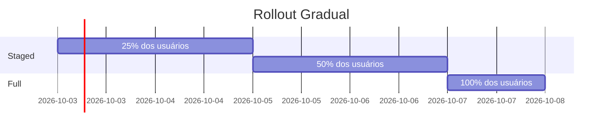

import { RoadmapGantt } from '@/components/interactive/RoadmapGantt'

# Roadmap de Implementação

## Timeline de 8 Semanas

Planejamento estratégico para implementação das oportunidades priorizadas, com foco em gerar valor incremental a cada sprint.

---

## Visão Geral

  

    ### Semanas 1-2
    **Quick Wins**

    9 oportunidades P0
    - Landing Page: 5 itens
    - Gestão Pagamento: 4 itens
  

  

    ### Semanas 3-5
    **Viabilidade**

    8 oportunidades P1
    - Transformações estruturais
    - Integrações complexas
  

  

    ### Semanas 6-7
    **Validação**

    - Testes A/B
    - Ajustes baseados em dados
    - Otimizações
  

  

    ### Semana 8
    **Deploy**

    - Rollout gradual
    - Monitoramento
    - Documentação
  

---

## Gantt Interativo

<RoadmapGantt />

---

## Fase 1: Quick Wins (Semanas 1-2)

### Objetivo
Gerar resultados rápidos e construir momentum para o projeto.

### Landing Page

  

    **[P0-LP-01]** Comparação lado-a-lado com concorrentes
    - **Timeline**: 3 dias
    - **Responsável**: Design + Dev Frontend
    - **Dependências**: Nenhuma
  

  

    **[P0-LP-02]** Calculadora de economia personalizada
    - **Timeline**: 4 dias
    - **Responsável**: Dev Frontend + Product
    - **Dependências**: P0-LP-01
  

  

    **[P0-LP-03]** Seção de FAQ expandida
    - **Timeline**: 2 dias
    - **Responsável**: Content + Dev Frontend
    - **Dependências**: Nenhuma
  

  

    **[P0-LP-04]** Prova social com testemunhos
    - **Timeline**: 3 dias
    - **Responsável**: Content + Design
    - **Dependências**: Nenhuma
  

  

    **[P0-LP-05]** CTA otimizado com urgência
    - **Timeline**: 2 dias
    - **Responsável**: Design + Dev Frontend
    - **Dependências**: Nenhuma
  

### Gestão de Pagamento

  

    **[P0-GP-01]** Notificações proativas antes da cobrança
    - **Timeline**: 5 dias
    - **Responsável**: Dev Backend + Frontend
    - **Dependências**: Nenhuma
  

  

    **[P0-GP-02]** Transparência total no painel
    - **Timeline**: 4 dias
    - **Responsável**: Design + Dev Frontend
    - **Dependências**: Nenhuma
  

  

    **[P0-GP-03]** Histórico de cobranças detalhado
    - **Timeline**: 3 dias
    - **Responsável**: Dev Backend + Frontend
    - **Dependências**: P0-GP-02
  

  

    **[P0-GP-04]** Processo de cancelamento simplificado
    - **Timeline**: 3 dias
    - **Responsável**: Design + Dev Frontend
    - **Dependências**: Nenhuma
  

**Entregáveis Semana 1-2:**
- 9 melhorias implementadas
- Dashboard de métricas configurado
- Primeira leva de testes A/B iniciada

---

## Fase 2: Viabilidade (Semanas 3-5)

### Objetivo
Implementar transformações estruturais de alto impacto.

### Oportunidades P1

  

    **[P1-01]** Sistema de onboarding progressivo
    - **Timeline**: 1 semana
    - **Responsável**: Design + Dev Frontend + Product
  

  

    **[P1-02]** Personalização baseada em comportamento
    - **Timeline**: 1.5 semanas
    - **Responsável**: Dev Backend + Data Science
  

  

    **[P1-03]** Dashboard de economia em tempo real
    - **Timeline**: 1 semana
    - **Responsável**: Design + Dev Frontend + Backend
  

  

    **[P1-04]** Programa de recompensas gamificado
    - **Timeline**: 2 semanas
    - **Responsável**: Product + Design + Dev Full Stack
  

**Entregáveis Semana 3-5:**
- 8 transformações estruturais concluídas
- Integrações com sistemas existentes
- Documentação técnica atualizada

---

## Fase 3: Validação (Semanas 6-7)

### Objetivo
Validar hipóteses e otimizar baseado em dados reais.

### Atividades

  

    #### Testes A/B

    - Variações de copywriting
    - Posicionamento de CTAs
    - Layout de comparação de preços
    - Fluxo de cancelamento
  

  

    #### Análise de Dados

    - Taxa de conversão por variante
    - Heat maps e scroll depth
    - User session recordings
    - Feedback qualitativo
  

  

    #### Ajustes

    - Refinamento de UX
    - Otimização de performance
    - Correção de bugs
    - Melhorias de acessibilidade
  

  

    #### Documentação

    - Playbooks de uso
    - Guidelines de conteúdo
    - Métricas de baseline
    - Learnings consolidados
  

---

## Fase 4: Deploy (Semana 8)

### Objetivo
Rollout gradual com monitoramento rigoroso.

### Estratégia de Rollout

### Checklist de Deploy

  

    <input type="checkbox" className="w-4 h-4" />
    Testes de regressão completados
  

  

    <input type="checkbox" className="w-4 h-4" />
    Performance benchmarks validados
  

  

    <input type="checkbox" className="w-4 h-4" />
    Acessibilidade auditada (WCAG AA)
  

  

    <input type="checkbox" className="w-4 h-4" />
    Documentação atualizada
  

  

    <input type="checkbox" className="w-4 h-4" />
    Playbooks de suporte criados
  

  

    <input type="checkbox" className="w-4 h-4" />
    Dashboards de monitoramento configurados
  

  

    <input type="checkbox" className="w-4 h-4" />
    Plano de rollback preparado
  

  

    <input type="checkbox" className="w-4 h-4" />
    Stakeholders comunicados
  

---

## Métricas de Sucesso

### KPIs por Fase

| Fase | Métrica | Baseline | Meta | Prazo |
|------|---------|----------|------|-------|
| Fase 1 | Taxa de Conversão LP | 2.5% | 4.0% | Semana 3 |
| Fase 1 | NPS Gestão Pagamento | 45 | 65 | Semana 3 |
| Fase 2 | Taxa de Ativação | 60% | 80% | Semana 6 |
| Fase 2 | Economia Percebida | R$ 150 | R$ 250 | Semana 6 |
| Fase 3 | Taxa de Retenção | 75% | 85% | Semana 8 |
| Fase 3 | Redução de Churn | Baseline | -40% | Semana 8 |

---

## Dependências e Riscos

### Dependências Críticas

  

    ⚠️ **Integração com Sistema de Pagamentos**
    - Necessário para P0-GP-01 e P0-GP-02
    - Coordenar com time de Backend
  

  

    ⚠️ **Dados de Comportamento do Usuário**
    - Necessário para P1-02
    - Coordenar com time de Data Science
  

  

    ⚠️ **Sistema de Notificações**
    - Necessário para P0-GP-01
    - Verificar capacidade de infraestrutura
  

### Riscos e Mitigações

| Risco | Probabilidade | Impacto | Mitigação |
|-------|---------------|---------|-----------|
| Atraso em integrações | Médio | Alto | Iniciar conversas técnicas na Semana 0 |
| Baixa adoção de features | Baixo | Médio | Testes A/B rigorosos na Fase 3 |
| Performance issues | Baixo | Alto | Load testing antes de cada deploy |
| Feedback negativo | Baixo | Médio | Rollout gradual com monitoramento |

---

  ### 🎯 Próximos Passos Imediatos

  1. **Semana 0 (Preparação)**:
     - Alinhar com stakeholders
     - Configurar ambiente de desenvolvimento
     - Preparar dashboards de métricas
     - Iniciar conversas técnicas sobre integrações

  2. **Kick-off Semana 1**:
     - Daily standups às 10h
     - Review de progresso toda sexta 16h
     - Sprint planning toda segunda 9h

  [Voltar para Executive Summary →](/)

